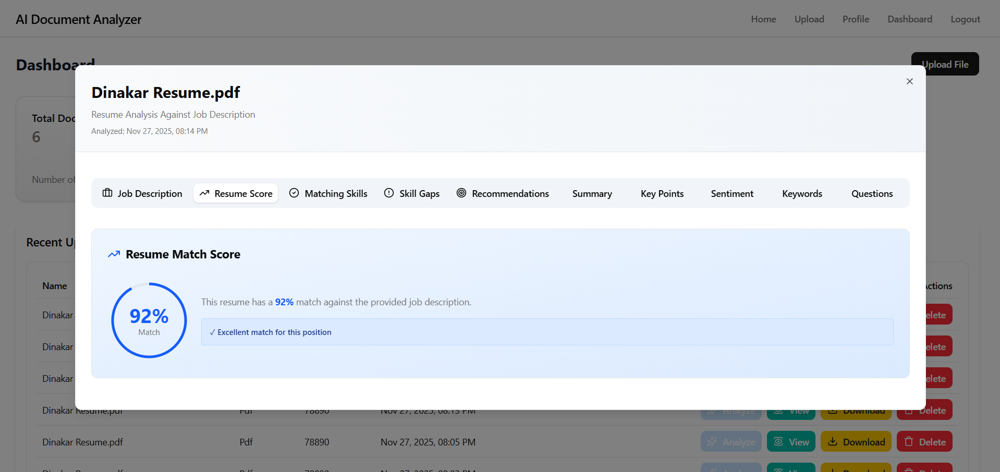

# AI Resume Analyzer & ATS Job Matching Platform

A full-stack web application designed to analyze resumes against specific Job Descriptions (JD) using Large Language Models (LLMs). The system parses uploaded resumes, evaluates keyword compatibility, identifies skill gaps, calculates an ATS match score (0–100), and offers actionable feedback to help candidates optimize their resumes for job applications.

---

## 📌 Project Overview

Traditional Applicant Tracking Systems (ATS) filter out candidate resumes based on strict keyword matching without understanding context. This project addresses that limitation by leveraging AI to perform semantic resume evaluation against job requirements.

### Key Objectives:
- **Resume Text Extraction**: Automatically extracts text from uploaded PDF and text resumes.
- **AI-Powered ATS Match Scoring**: Computes a detailed match score based on skills, experience, and role alignment.
- **Skill Gap & Keyword Analysis**: Highlights candidate strengths, missing skills, and tailored recommendations.
- **Multi-Provider AI Support**: Integrates with OpenAI, Google Gemini, and Anthropic Claude APIs.
- **Real-Time Job Updates**: Uses Socket.io to notify users when asynchronous resume analysis completes.

---

## 🛠️ Tech Stack

### Frontend
- **Framework**: React.js (Vite)
- **Styling**: Tailwind CSS & Radix UI
- **State Management**: Zustand
- **Real-Time Communication**: Socket.io Client
- **Icons & Visuals**: Lucide React & Recharts

### Backend
- **Runtime**: Node.js & Express.js
- **Database**: MongoDB (Mongoose ORM)
- **Authentication**: JWT (JSON Web Tokens) & BcryptJS
- **File Handling & Parsing**: Multer & PDF-Parse
- **AI Adapters**: OpenAI SDK, `@google/generative-ai`, Anthropic SDK

---

## 📁 Repository Structure

```
AI-Resume-Analyzer-ATS-Job-Matching-Platform/
│
├── ai-resume-analyzer/
│   ├── backend/
│   │   ├── config/          # Database connection
│   │   ├── controllers/     # Route controllers (Auth, Documents)
│   │   ├── jobs/            # Queue worker for AI LLM processing
│   │   ├── middleware/      # Auth & validation middlewares
│   │   ├── models/          # MongoDB schemas (User, Document, Analysis)
│   │   ├── routes/          # Express API endpoints
│   │   ├── utils/           # AI adapters & socket initializers
│   │   └── server.js        # Main entry point
│   │
│   └── frontend/
│       ├── src/
│       │   ├── components/  # Navigation, modals, UI components
│       │   ├── pages/       # Home, Dashboard, Upload, Profile
│       │   ├── stores/      # Zustand auth & document state
│       │   └── utils/       # Axios API client
│       └── vite.config.js
│
└── README.md
```

---

## 💻 Installation & Setup

### Prerequisites
- Node.js (v18 or higher)
- npm or yarn
- MongoDB instance (local or MongoDB Atlas connection string)

### 1. Clone the Repository
```bash
git clone https://github.com/vivek-singh-18/AI-Resume-Analyzer-ATS-Job-Matching-Platform.git
cd AI-Resume-Analyzer-ATS-Job-Matching-Platform/ai-resume-analyzer
```

### 2. Backend Setup
```bash
cd backend
npm install
```

Create a `.env` file inside the `backend/` directory:
```env
PORT=5000
MONGO_URI=mongodb://localhost:27017/ai-resume-analyzer
JWT_SECRET=your_jwt_secret_key_here
OPENAI_API_KEY=your_openai_api_key_optional
```

Start the backend server:
```bash
npm run dev
```

### 3. Frontend Setup
```bash
cd ../frontend
npm install
```

Start the frontend development server:
```bash
npm run dev
```

The application will be accessible at `http://localhost:5173`.

---

## 📸 Screenshots

| Upload & Job Description Input | Detailed Resume Insights |
| :---: | :---: |
|  |  |

---

## 🔄 How Analysis Works

1. User registers/logs in and navigates to the **Upload** page.
2. The user uploads a resume file (`PDF`/`TXT`) and optionally pastes a target **Job Description**.
3. The backend receives the file, extracts raw text using `pdf-parse`, and saves the document record in MongoDB.
4. An asynchronous worker task (`jobs/worker.js`) formats a prompt containing the resume text + JD and sends it to the configured AI model.
5. The AI returns structured JSON containing:
   - Overall Resume Fit Score (0-100)
   - Matching Skills
   - Skill Gaps & Deficiencies
   - Actionable Recommendations
   - Key Keywords & Interview Questions
6. Structured results are saved into the `Analysis` collection, and Socket.io notifies the frontend UI to display the breakdown.

---

## 🧑‍💻 Author

**Vivek**  
*AI Resume Analyzer & ATS Job Matching Platform*  
GitHub: [@vivek-singh-18](https://github.com/vivek-singh-18)
